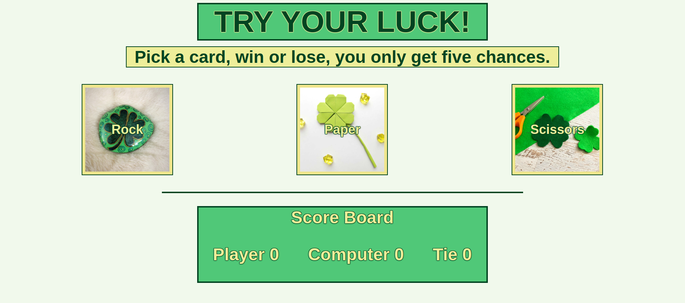

# Rock-Paper-Scissors

Objective:

I am creating a Rock, Paper, Scissors game to utilize some skills that I've learned in HTML, CSS, and JavaScript. This is my first JavaScript project.

***Completed Game Images***

Before Game Starts:

After Player's Move:

After Game Completes:

***Game Features***

1. The player will see the game title and instructions at the top of the page.
2. The player chooses the rock, paper, or scissors image. 
3. The player will recieve a message for their image choice played against the computer choice. The messages are tailored to each pairing of random choices and return a message letting the player know if they've won, lost, or tied. The reason for the win or loss will be displayed on the screen. Examples: ("You Win! Rock beats scissors everytime!") or ("You Lose! Rock beats Scissors everytime!")
4. The game will automatically play five rounds as the player chooses their move.
5. After five rounds the player will be notified if they won, lost, or tied with the computer and given instruction to reload the page to play again.
6. The scoreboard keeps tracks of wins, losses, and ties for the player each round and displays them for easy reference.

***Credits***

The scissors/clover imgage was found on the blog "This Mom's Confessions". https://www.janinehuldie.com/four-leaf-clover-hair-clips/

The rock/clover imgage was found on etsy the creater is RockyPebblesByCC. https://www.etsy.com/dk-en/listing/1197729148/shamrock-painted-rock-good-luck-clover

The paper/clover imgage was found on the blog "Easy Hand Made Ideas". https://www.easyhandmadeideas.com/diy-paper-four-leaf-clover-in-the-origami-technique/
